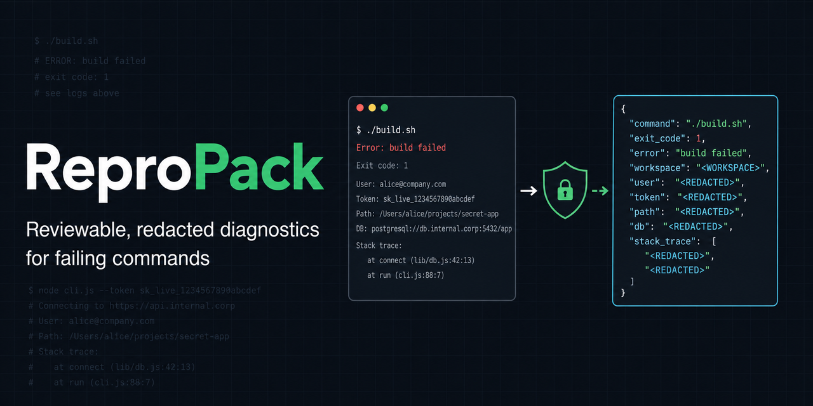

# ReproPack

[](https://github.com/zuythu3-sudo/repropack/actions/workflows/ci.yml)
[](https://nodejs.org/)
[](LICENSE)



ReproPack turns a failing command into a reviewable, redacted diagnostic report.

It captures the command result, a small set of runtime facts, repository state, and
bounded output in one `.repropack.json` file. The report can be inspected before it
is shared and validated without running the captured command.

> ReproPack reduces accidental disclosure; it cannot prove that a report is free
> of sensitive information. Always review a report before publishing it.

## Quick start

ReproPack requires Node.js 20 or newer.

```sh
npm install --global repropack-cli

# Everything after -- is passed directly to the program.
repropack capture --output failure.repropack.json -- npm test

# Review and validate the report before sharing it.
repropack inspect failure.repropack.json --show-output
repropack validate failure.repropack.json --strict

# Produce Markdown suitable for a GitHub issue.
repropack render failure.repropack.json --format github
```

`capture` preserves argument boundaries and starts native executables with shell
handling disabled. Windows `.cmd` and `.bat` wrappers use the operating-system
dispatcher with command-interpreter metacharacters rejected. After the program
exits, ReproPack shows a privacy summary before writing the report. Use `--yes`
only when an interactive confirmation is not possible, such as in CI. ReproPack
exits with the captured program's exit code after a report is written.

## Commands

| Command | Purpose |
| --- | --- |
| `repropack init [--github]` | Add starter ReproPack files to the current project and, optionally, GitHub integration files. |
| `repropack capture [--output FILE] [--yes] -- PROGRAM [ARGS...]` | Run a program directly and create a redacted diagnostic report. |
| `repropack inspect FILE [--show-output] [--json]` | Review report metadata and redaction warnings without executing its contents. |
| `repropack validate FILE [--strict] [--json]` | Validate a report against the supported schema; strict mode also rejects residual-risk warnings. |
| `repropack render FILE --format github` | Render a validated report as safe, copyable Markdown. |

The default capture timeout is 10 minutes. Standard output and standard error are
limited to 1 MiB each, and a report may not exceed 3 MiB. Existing output files
are never overwritten.

## What a report contains

A v1 report includes:

- the redacted argument vector, working-directory placeholder, exit status,
  signal, duration, and timeout status;
- operating-system release, architecture, and Node.js/npm versions;
- when available, the Git commit, dirty state, package-manager name, and a
  SHA-256 digest of the lockfile;
- bounded, sanitized stdout and stderr; and
- redaction counts, truncation markers, encoding markers, and residual-risk
  warnings.

It does not include the hostname, username, Git remote, arbitrary environment
variables, source files, attachments, or dependency manifests. See the
[report format](docs/report-format.md) for the complete schema.

## Privacy by default

ReproPack processes reports locally and does not upload data, call an AI service,
or collect telemetry. Capture applies control-character cleanup, local-path
replacement, credential redaction, output limits, and a final residual scan.
Values of sensitive environment variables may be used in memory as redaction
needles, but environment variables are never written to the report.

Reports and commands remain untrusted data:

- `inspect`, `validate`, `render`, and the GitHub Action never execute captured
  commands, open URLs, or fetch remote content;
- `capture` runs the command with your current user permissions and is not a
  sandbox; and
- automatic redaction is defense in depth, not a substitute for human review.

Read the [threat model](docs/threat-model.md) before using ReproPack with
untrusted commands or logs. Security issues should be reported according to
[SECURITY.md](SECURITY.md).

## GitHub Action

The read-only GitHub Action validates an existing `.repropack.json` file and
reports the result in the job log. It does not capture or replay commands. Keep the
workflow permission at `contents: read`, and do not use `pull_request_target` to
process files supplied by an untrusted pull request. See the
[GitHub Action guide](docs/github-action.md).

## Integrations

| Integration | Use |
| --- | --- |
| [Codex triage skill](integrations/codex/triage-repropack) | Validate a report and draft diagnostic hypotheses, missing-information questions, and regression-test ideas for human review. |

## Documentation

- [Report format and versioning](docs/report-format.md)
- [Threat model](docs/threat-model.md)
- [Compatibility](docs/compatibility.md)
- [Troubleshooting](docs/troubleshooting.md)
- [GitHub Action](docs/github-action.md)
- [Roadmap](ROADMAP.md)
- [Contributing](CONTRIBUTING.md)

## License

Licensed under the [Apache License 2.0](LICENSE).
